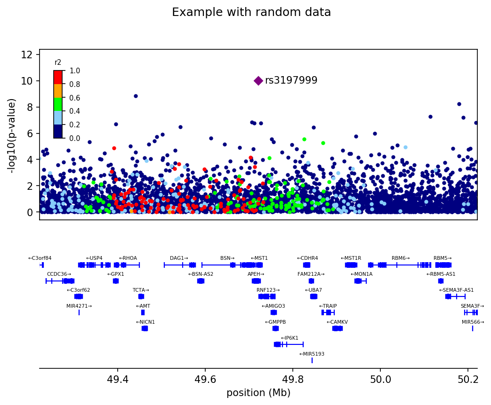

# locuszoomplot
Pure Python plotting of genomic regions around a variant

This is a python module that provides python plotting functions for the R2 and p-values of variants in a nearby region of a reference or target variant.

Here's a basic plot:

The example code is at `examples/plot_basic_locuszoom.py`

## Dependencies 

The implementation relies on
 * databases from locuszoom-1.4 at https://statgen.sph.umich.edu/locuszoom/download/locuszoom_1.4.tgz
 * SQLite
 * plink 1.90 at https://www.cog-genomics.org/plink/1.9/
 
## Issues
Sometimes if a gene region overlaps the window edges there's some displacement of the gene name in the plot

